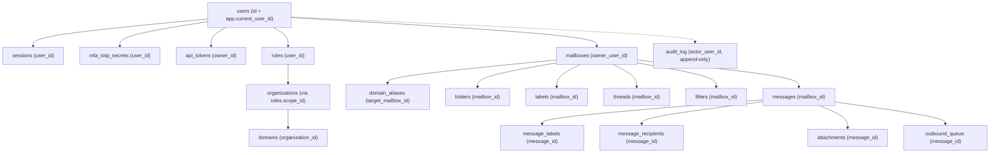

# Eazzio Mail — RLS_OWNERSHIP_MAP.md
## Relational Ownership Graph & Row Level Security Mapping

**Document Type:** Database Multi-Tenancy & Row Level Security Ownership Map  
**Parent Documents:** `Docs/Security.md` Section 3 · `Docs/LLD.md` Section 1 · `Docs/DECISIONS.md` D-004  
**Status:** Canonical RLS Model (Task-003)

---

## 1. Schema Classification & Ownership Matrix

All 19 relational tables in `001_initial_schema.sql` are classified and mapped to their strict tenant ownership paths:

| Table | Classification | Tenant Owner | Ownership Path | SELECT Policy | INSERT Policy (`WITH CHECK`) | UPDATE Policy (`WITH CHECK`) | DELETE Policy |
|---|---|---|---|---|---|---|---|
| `users` | TENANT-SENSITIVE | User | `id = app.current_user_id` | Own user record only | Self registration | Own profile fields (cannot change id/email to others) | Denied / Soft delete |
| `mfa_totp_secrets` | TENANT-SENSITIVE | User | `user_id = app.current_user_id` | Own secret only | Own secret only | Own secret only | Own secret only |
| `sessions` | TENANT-SENSITIVE | User | `user_id = app.current_user_id` | Own sessions only | Own sessions only | Own sessions only | Own sessions only |
| `api_tokens` | TENANT-SENSITIVE | User | `owner_id = app.current_user_id` | Own tokens only | Own tokens only | Own tokens only | Own tokens only |
| `roles` | TENANT-SENSITIVE | User / Org | `user_id = app.current_user_id` or `platform_admin` | Own roles or admin | Admin only | Admin only | Admin only |
| `organizations` | TENANT-SENSITIVE | Org Member | `id IN (roles.scope_id WHERE roles.user_id = app.current_user_id)` or `platform_admin` | Member orgs | Org creation / Platform Admin | Org Admin | Platform Admin |
| `domains` | TENANT-SENSITIVE | Organization | `organization_id IN (roles.scope_id WHERE roles.user_id = app.current_user_id)` or `platform_admin` | Org domains | Org Admin | Org Admin (cannot reassign org) | Org Admin |
| `domain_aliases` | TENANT-SENSITIVE | Mailbox | `target_mailbox_id -> mailboxes.owner_user_id = app.current_user_id` | Own aliases | Own mailbox aliases | Own mailbox aliases | Own mailbox aliases |
| `mailboxes` | TENANT-SENSITIVE | User | `owner_user_id = app.current_user_id` | Own mailboxes | Own mailboxes | Own mailboxes | Own mailboxes |
| `folders` | TENANT-SENSITIVE | Mailbox | `mailbox_id -> mailboxes.owner_user_id = app.current_user_id` | Own mailbox folders | Own mailbox folders | Own mailbox folders (cannot reassign mailbox) | Own mailbox folders |
| `labels` | TENANT-SENSITIVE | Mailbox | `mailbox_id -> mailboxes.owner_user_id = app.current_user_id` | Own mailbox labels | Own mailbox labels | Own mailbox labels (cannot reassign mailbox) | Own mailbox labels |
| `threads` | TENANT-SENSITIVE | Mailbox | `mailbox_id -> mailboxes.owner_user_id = app.current_user_id` | Own mailbox threads | Own mailbox threads | Own mailbox threads | Own mailbox threads |
| `messages` | TENANT-SENSITIVE | Mailbox | `mailbox_id -> mailboxes.owner_user_id = app.current_user_id` | Own mailbox messages | Own mailbox messages | Own mailbox messages (flags, folder, labels) | Own mailbox messages (move to trash) |
| `message_labels` | TENANT-SENSITIVE | Message | `message_id -> messages.mailbox_id -> mailboxes.owner_user_id = app.current_user_id` | Own message labels | Own message labels | Own message labels | Own message labels |
| `message_recipients` | TENANT-SENSITIVE | Message | `message_id -> messages.mailbox_id -> mailboxes.owner_user_id = app.current_user_id` | Own message recipients | Own message recipients | Own message recipients | Own message recipients |
| `attachments` | TENANT-SENSITIVE | Message | `message_id -> messages.mailbox_id -> mailboxes.owner_user_id = app.current_user_id` | Own attachments | Own message attachments | Own message attachments | Own message attachments |
| `filters` | TENANT-SENSITIVE | Mailbox | `mailbox_id -> mailboxes.owner_user_id = app.current_user_id` | Own mailbox filters | Own mailbox filters | Own mailbox filters | Own mailbox filters |
| `outbound_queue` | TENANT-SENSITIVE | Message | `message_id -> messages.mailbox_id -> mailboxes.owner_user_id = app.current_user_id` | Own outbound queue | Own outbound queue | Queue runner / Own message | Own outbound queue |
| `audit_log` | SYSTEM / AUDIT | Actor / System | Append-only insert; Select by actor or platform_admin | Actor / Admin | Authenticated insert | **REVOKED (No UPDATE)** | **REVOKED (No DELETE)** |

---

## 2. Ownership Graph Visualization

---

## 3. Defense-in-Depth RLS Rules

1. **Explicit `USING` and `WITH CHECK` Clauses:**
   - Every `FOR ALL` policy must include both `USING` (read/existing-row visibility) and `WITH CHECK` (new-row/updated-row validation).
   - This prevents cross-tenant ownership theft where an attacker attempts to update `mailbox_id` or `organization_id` to transfer records to another tenant.
2. **Immutable Audit Trail:**
   - `UPDATE` and `DELETE` remain permanently revoked on `audit_log` from all non-superuser application roles.
3. **AI Gateway Isolation:**
   - `eazzio_ai_gateway` role has `SELECT` only on `messages`, `threads`, `mailboxes`, and is revoked from all write operations.
