# 🌐 Eazzio Mail — Zero-Cost Live Inbound Bridge & Poller

---

## 1. Overview & Architectural Design

When developing Eazzio Mail locally behind a residential internet connection (Airtel CGNAT) with:
- **Zero domain purchase**
- **Zero card verification**
- **Zero VPS / cloud hosting costs**

The **Inbound Poller Bridge** ([`scripts/poll-inbound.ts`](file:///home/rahul-kumar/Desktop/Eazzio_Mail/scripts/poll-inbound.ts)) provides a live, zero-cost bridge that allows external email providers (such as personal Gmail, Outlook, Yahoo) to send real emails to a publicly receivable address and have them ingested automatically into the local Eazzio Mail system.

```mermaid
graph LR
    Sender[External Sender: Gmail / Outlook] -->|1. Real SMTP :25| PublicEdge[Public Mail Edge]
    PublicEdge -->|2. Inbound REST API| Poller[Eazzio Inbound Poller: scripts/poll-inbound.ts]
    Poller -->|3. Live LMTP Socket :2424| Daemon[services/mail-inbound]
    Daemon -->|4. InboundPipeline & Security| DB[(PostgreSQL & MinIO)]
    DB -->|5. WebSocket & REST API :8080| UI[Next.js Web UI & Flutter App]
```



---

## 2. How to Run the Inbound Poller

### Step 1: Ensure Local Eazzio Stack is Running
Make sure PostgreSQL and the Inbound LMTP daemon are active:

```bash
# Start background stack
pnpm dev
```

### Step 2: Start the Inbound Poller
In a terminal, run:

```bash
pnpm mail:poller
```

Output:
```text
════════════════════════════════════════════════════════════════
🌐 EAZZIO MAIL — ZERO-COST INTERNET INBOUND BRIDGE & POLLER
════════════════════════════════════════════════════════════════

[Step 1] Initializing Public Inbound Mailbox Bridge...
────────────────────────────────────────────────────────────────
📬 PUBLIC EMAIL RECEIVING ADDRESS IS ACTIVE:
👉  eazziotestrahul@emalupe.com
────────────────────────────────────────────────────────────────
ℹ️  Send ANY real email from personal Gmail to: eazziotestrahul@emalupe.com
ℹ️  Incoming emails will automatically route to: rahulkumar@eazzio.com
ℹ️  Polling interval: 4 seconds
```

---

## 3. How to Test with Personal Gmail

1. Open your personal Gmail app (or web).
2. Compose a new email:
   - **To:** `<THE_ADDRESS_DISPLAYED_IN_TERMINAL>` (e.g. `eazziotestrahul@emalupe.com`)
   - **Subject:** `Hello from My Personal Gmail!`
   - **Body:** `Testing live internet inbound delivery into Eazzio Mail.`
3. Click **Send** in Gmail.
4. Within 4–8 seconds, the poller will detect the incoming email, download the raw RFC 822 `.eml` bytes, stream them over the local LMTP TCP socket (`127.0.0.1:2424`), and display:
   ```text
   ⚡ NEW INCOMING INTERNET EMAIL DETECTED!
      • From:    kumarrahulraj468@gmail.com
      • Subject: Hello from My Personal Gmail!
      • Ingesting 3079 bytes into local LMTP daemon (127.0.0.1:2424)...
      🟢 250 Message Accepted by Eazzio Pipeline! [Message ID: 6a8ac3aa...]
      ✅ Persisted into PostgreSQL and broadcasted to Web UI / Mobile App!
   ```
5. Open **[http://localhost:3000](http://localhost:3000)** and sign in as `rahulkumar@eazzio.com` — the email appears instantly in your inbox!

---

## 4. Technical Guarantees

- **100% Real Inbound Code Path:** The incoming email is processed by `InboundPipeline`, `MimeParser`, `decide()` security gate, `PostgresMessageRepository`, and the WebSocket gateway.
- **Zero Duplicate Deliveries:** Messages are deleted from the remote edge upon successful LMTP acceptance.
- **₹0 Cost Forever:** No credit cards, domain registrations, or VPS subscriptions required.
