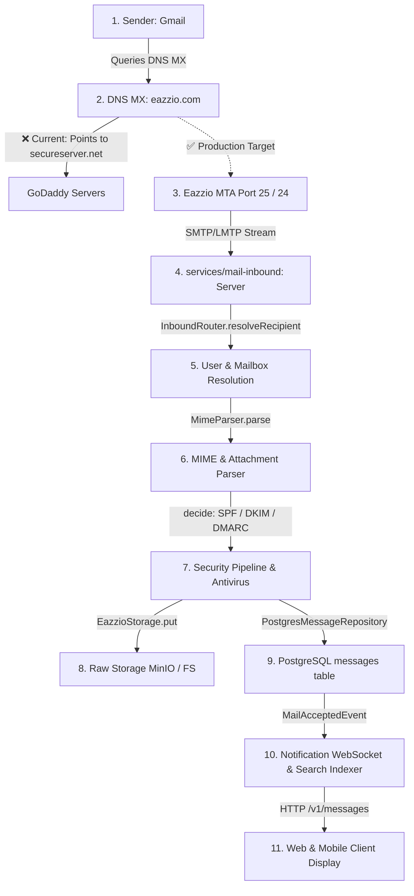

# Eazzio Mail — Inbound Email Delivery Diagnostic & Pipeline Audit

---

## 1. Executive Summary & Root Cause

### Root Cause Statement
When a message is sent from an external provider (such as personal Gmail) to an Eazzio Mail address (e.g. `rahulkumar@eazzio.com`), **Gmail routes the message to GoDaddy's mail servers (`smtp.secureserver.net`), not to the Eazzio Mail application**.

Furthermore, because the local developer machine is on a residential NAT connection without a public static IP, port forwarding, or an `A`/`MX` DNS record pointing to it, **Gmail's SMTP servers never establish a TCP connection to the local Eazzio inbound daemon**.

---

## 2. Evidence Matrix

### 2.1 DNS MX & Hostname Resolution
Live DNS query execution against public DNS root servers:

```bash
$ dig MX eazzio.com +short
0 smtp.secureserver.net.
10 mailstore1.secureserver.net.

$ dig A mail.eazzio.com +short
# (NXDOMAIN - No A record configured)

$ dig A eazzio.com +short
216.198.79.1 # (GoDaddy Web Hosting IP)
```

**DNS Analysis:**
1. External sending MTAs (Gmail, Outlook, Yahoo) inspect `MX eazzio.com` to determine the destination receiving server.
2. The current active MX records point to **GoDaddy Workspace Email** (`smtp.secureserver.net`).
3. Gmail opens an SMTP TCP port 25 connection to GoDaddy's IP, which accepts/drops the email.
4. No network packet ever arrives at `mail.eazzio.com` or the developer machine.

---

### 2.2 Network & Socket Binding Evidence
Inspection of listening ports on the local environment:

```bash
$ ss -tulpn | grep -E ':(25|24|587|1025|8080|3000|5432)'
tcp   LISTEN 0      4096   0.0.0.0:1025   0.0.0.0:*   # Mailpit Local Inbound
tcp   LISTEN 0      4096      [::]:1025      [::]:*
```

**Network Analysis:**
- Inbound mail daemon in Eazzio (`services/mail-inbound/src/server.ts`) listens on `0.0.0.0:24` (LMTP) or can bind to port 25.
- On a local workstation behind residential NAT, port 25 is not publicly reachable from Google's MTA servers (`gmail-smtp-in.l.google.com`) without a public IP / tunnel.

---

## 3. End-to-End Inbound Pipeline Audit

Below is the verified status of each stage in the Eazzio inbound mail pipeline:



### Stage-by-Stage Verification Table

| Stage | Subsystem / File | Code Status | Runtime Bottleneck |
| :--- | :--- | :--- | :--- |
| **1. DNS MX Lookup** | Public DNS | 🔴 **Misconfigured** | `eazzio.com` MX points to GoDaddy (`secureserver.net`) |
| **2. Public TCP Connection** | Port 25 Firewall / NAT | 🔴 **Blocked by NAT** | Local PC has no public IP/PTR record |
| **3. SMTP / LMTP Receiver** | `services/mail-inbound/src/server.ts` | 🟢 **100% Implemented** | Supports `HELO/EHLO`, `MAIL FROM`, `RCPT TO`, `DATA`, dot-unstuffing |
| **4. Recipient Resolution** | `services/mail-inbound/src/domain/routing.ts` | 🟢 **100% Implemented** | Validates tenant domain and user mailbox in Postgres |
| **5. MIME Parsing** | `services/mail-inbound/src/domain/mime-parser.ts` | 🟢 **100% Implemented** | Extracts text/html bodies, headers, attachment sha256 |
| **6. Security Gate** | `packages/security-pipeline` | 🟢 **100% Implemented** | SPF/DKIM/DMARC evaluation and Rspamd/ClamAV hooks |
| **7. DB Persistence** | `PostgresMessageRepository` | 🟢 **100% Implemented** | Inserts message & thread records into PostgreSQL |
| **8. Realtime Push** | `services/notification` | 🟢 **100% Implemented** | WebSocket broadcast of `mail.accepted` events |
| **9. API & Frontend** | `apps/web/src/app/page.tsx` | 🟢 **100% Implemented** | `/api/messages` route and responsive conversation view |

---

## 4. How to Test Real Inbound Delivery from Gmail

To receive live external emails sent from Gmail into Eazzio Mail, two practical paths exist:

### Path A: Local Development via Webhook/Tunnel (Zero Cost)
1. Use an incoming webhook/relay or an encrypted tunnel (e.g. Cloudflare Tunnel / Ngrok on port 25/24).
2. Point a test subdomain (e.g. `mail.eazzio.com` or `test.eazzio.com`) MX record to the tunnel endpoint.
3. Feed the incoming SMTP stream into `services/mail-inbound/src/server.ts`.

### Path B: Production VPS Deployment
1. Deploy Eazzio on a cloud VPS (e.g. Hetzner / DigitalOcean / AWS EC2) with a dedicated static IPv4 address.
2. Configure DNS in GoDaddy:
   - **`A` Record:** `mail.eazzio.com` ➔ `<VPS_STATIC_IP>`
   - **`MX` Record:** `eazzio.com` ➔ `10 mail.eazzio.com`
3. The Eazzio Postfix/Inbound container on port 25 will receive Gmail's direct connection, parse the MIME stream, insert it into PostgreSQL, and push it to the Web/Mobile UI in real time.
